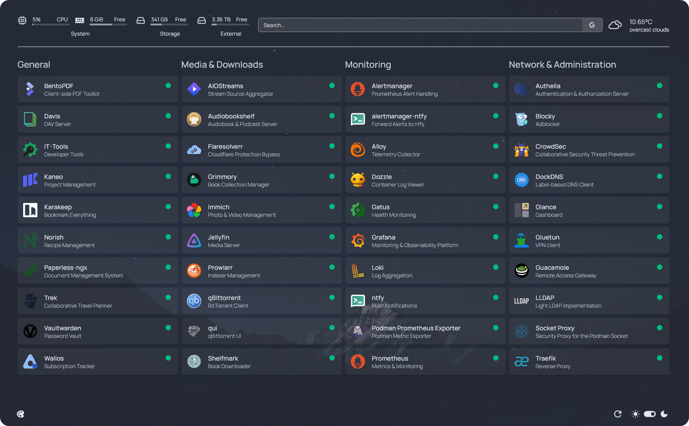

<p align="center">
   
</p>
<p align="center">
   <a href="https://builtwithnix.org"></a>
   
   <a href="https://renovatebot.com">
   </a>
   <a href="https://tarow.github.io/nix-podman-stacks/docs">
   </a>
   <a href="https://tarow.github.io/nix-podman-stacks/search">
   </a>
</p>

# Nix Podman Stacks

<p align="center">

</p>

Collection of opinionated Podman stacks managed by [Home Manager](https://github.com/nix-community/home-manager).

The goal is to easily deploy various self-hosted projects, including a reverse proxy, dashboard and monitoring setup. Under the hood rootless Podman (Quadlets) will be used to run the containers. It works on most Linux distros including Ubuntu, Arch, Mint, Fedora & more and is not limited to NixOS.

The projects also contains integrations with Traefik, Homepage, Grafana and more. Some examples include:

- Enabling a stack will add the respective containers to Traefik and Homepage
- Enabling CrowdSec or Authelia will automatically configure necessary Traefik plugins and middlewares
- When stacks support exporting metrics, scrape configs for Prometheus can be automatically set up
- Similariy, Grafana dashboards for Traefik, Blocky & others can be automatically added
- and more ...

While most stacks can be activated by setting a single flag, some stacks require setting mandatory values, especially for secrets.
For managing secrets, projects such as [sops-nix](https://github.com/Mic92/sops-nix) or [agenix](https://github.com/ryantm/agenix) can be used, which allow you to store your secrets along with the configuration inside a single Git repository.

## Example

Simple example of how to enable Traefik (including LetsEncrypt certificates & Geoblocking), Paperless & Homepage:

```nix
{config, ...}:
{
  nps.stacks = {
    homepage.enable = true;
    paperless = {
      enable = true;
      secretKeyFile = config.sops.secrets."paperless/secret_key".path;
      db.passwordFile = config.sops.secrets."paperless/db_password".path;
    };
    traefik = {
      enable = true;
      domain = "example.com";
      geoblock.allowedCountries = ["DE"];
      extraEnv.CF_DNS_API_TOKEN.fromFile = config.sops.secrets."traefik/cf_api_token".path;
    };
  };
}
```

Services will be automatially added to Homepage and are available via the Traefik reverse proxy.

## 📔 Option Documentation

Refer to the [documentation](https://tarow.github.io/nix-podman-stacks/docs) to get a started and see a list of available options.

There is also an [Option Search](https://tarow.github.io/nix-podman-stacks/search) to easily explore existing options.

## 📦 Available Stacks

-  [Adguard](https://tarow.github.io/nix-podman-stacks/docs/stacks/adguard.html)
-  [AdventureLog](https://tarow.github.io/nix-podman-stacks/docs/stacks/adventurelog.html)
-  [AIOStreams](https://tarow.github.io/nix-podman-stacks/docs/stacks/aiostreams.html)
-  [Audiobookshelf](https://tarow.github.io/nix-podman-stacks/docs/stacks/audiobookshelf.html)
-  [Authelia](https://tarow.github.io/nix-podman-stacks/docs/stacks/authelia.html)
-  [Baikal](https://tarow.github.io/nix-podman-stacks/docs/stacks/baikal.html)
-  [BentoPDF](https://tarow.github.io/nix-podman-stacks/docs/stacks/bentopdf.html)
-  [Beszel](https://tarow.github.io/nix-podman-stacks/docs/stacks/beszel.html)
-  [Blocky](https://tarow.github.io/nix-podman-stacks/docs/stacks/blocky.html)
-  [Booklore](https://tarow.github.io/nix-podman-stacks/docs/stacks/booklore.html)
-  [ByteStash](https://tarow.github.io/nix-podman-stacks/docs/stacks/bytestash.html)
-  [Calibre-Web Automated](https://tarow.github.io/nix-podman-stacks/docs/stacks/calibre.html)
-  [Changedetection](https://tarow.github.io/nix-podman-stacks/docs/stacks/changedetection.html)
  -  Changedetection
  -  Sock Puppet Browser
-  [CrowdSec](https://tarow.github.io/nix-podman-stacks/docs/stacks/crowdsec.html)
-  [Davis](https://tarow.github.io/nix-podman-stacks/docs/stacks/davis.html)
-  [DDNS-Updater](https://tarow.github.io/nix-podman-stacks/docs/stacks/ddns-updater.html)
-  [DockDNS](https://tarow.github.io/nix-podman-stacks/docs/stacks/dockdns.html)
-  [Docker Socket Proxy](https://tarow.github.io/nix-podman-stacks/docs/stacks/docker-socket-proxy.html)
-  [Donetick](https://tarow.github.io/nix-podman-stacks/docs/stacks/donetick.html)
-  [Dozzle](https://tarow.github.io/nix-podman-stacks/docs/stacks/dozzle.html)
-  [Ephemera](https://tarow.github.io/nix-podman-stacks/docs/stacks/ephemera.html)
-  [Filebrowser](https://tarow.github.io/nix-podman-stacks/docs/stacks/filebrowser.html)
-  [Filebrowser Quantum](https://tarow.github.io/nix-podman-stacks/docs/stacks/filebrowser-quantum.html)
-  [Flaresolverr](https://tarow.github.io/nix-podman-stacks/docs/stacks/flaresolverr.html)
-  [Forgejo](https://tarow.github.io/nix-podman-stacks/docs/stacks/forgejo.html)
-  [Free Games Claimer](https://tarow.github.io/nix-podman-stacks/docs/stacks/free-games-claimer.html)
-  [FreshRSS](https://tarow.github.io/nix-podman-stacks/docs/stacks/freshrss.html)
-  [Gatus](https://tarow.github.io/nix-podman-stacks/docs/stacks/gatus.html)
-  [Glance](https://tarow.github.io/nix-podman-stacks/docs/stacks/glance.html)
-  [Guacamole](https://tarow.github.io/nix-podman-stacks/docs/stacks/guacamole.html)
-  [Healthchecks](https://tarow.github.io/nix-podman-stacks/docs/stacks/healthchecks.html)
-  [Home Assistant](https://tarow.github.io/nix-podman-stacks/docs/stacks/homeassistant.html)
-  [Homepage](https://tarow.github.io/nix-podman-stacks/docs/stacks/homepage.html)
-  [HortusFox](https://tarow.github.io/nix-podman-stacks/docs/stacks/hortusfox.html)
-  [Immich](https://tarow.github.io/nix-podman-stacks/docs/stacks/immich.html)
-  [IT-Tools](https://tarow.github.io/nix-podman-stacks/docs/stacks/it-tools.html)
-  [Jotty](https://tarow.github.io/nix-podman-stacks/docs/stacks/jotty.html)
-  [Kaneo](https://tarow.github.io/nix-podman-stacks/docs/stacks/kaneo.html)
-  [Karakeep](https://tarow.github.io/nix-podman-stacks/docs/stacks/karakeep.html)
-  [Kimai](https://tarow.github.io/nix-podman-stacks/docs/stacks/kimai.html)
-  [KitchenOwl](https://tarow.github.io/nix-podman-stacks/docs/stacks/kitchenowl.html)
-  [Komga](https://tarow.github.io/nix-podman-stacks/docs/stacks/komga.html)
-  [Leantime](https://tarow.github.io/nix-podman-stacks/docs/stacks/leantime.html)
-  [LLDAP](https://tarow.github.io/nix-podman-stacks/docs/stacks/lldap.html)
-  [Mazanoke](https://tarow.github.io/nix-podman-stacks/docs/stacks/mazanoke.html)
-  [Mealie](https://tarow.github.io/nix-podman-stacks/docs/stacks/mealie.html)
-  [Memos](https://tarow.github.io/nix-podman-stacks/docs/stacks/memos.html)
-  [MicroBin](https://tarow.github.io/nix-podman-stacks/docs/stacks/microbin.html)
- 🔍 [Monitoring](https://tarow.github.io/nix-podman-stacks/docs/stacks/monitoring.html)
  -  Alloy
  -  Grafana
  -  Loki
  -  Prometheus
  -  Alertmanager
  -  Alertmanager-ntfy
  -  Podman Metrics Exporter
-  [n8n](https://tarow.github.io/nix-podman-stacks/docs/stacks/n8n.html)
-  [Navidrome](https://tarow.github.io/nix-podman-stacks/docs/stacks/navidrome.html)
-  [Networking Toolbox](https://tarow.github.io/nix-podman-stacks/docs/stacks/networking-toolbox.html)
-  [Norish](https://tarow.github.io/nix-podman-stacks/docs/stacks/norish.html)
-  [ntfy](https://tarow.github.io/nix-podman-stacks/docs/stacks/ntfy.html)
-  [OmniTools](https://tarow.github.io/nix-podman-stacks/docs/stacks/omnitools.html)
-  [Outline](https://tarow.github.io/nix-podman-stacks/docs/stacks/outline.html)
-  [Pangolin-Newt](https://tarow.github.io/nix-podman-stacks/docs/stacks/pangolin-newt.html)
-  [Paperless-ngx](https://tarow.github.io/nix-podman-stacks/docs/stacks/paperless.html)
  -  Paperless-ngx
  - 📂 FTP Server
-  [Papra](https://tarow.github.io/nix-podman-stacks/docs/stacks/papra.html)
-  [RomM](https://tarow.github.io/nix-podman-stacks/docs/stacks/romm.html)
-  [SearXNG](https://tarow.github.io/nix-podman-stacks/docs/stacks/searxng.html)
-  [Shelfmark](https://tarow.github.io/nix-podman-stacks/docs/stacks/shelfmark.html)
-  [Sshwifty](https://tarow.github.io/nix-podman-stacks/docs/stacks/sshwifty.html)
-  [Stirling-PDF](https://tarow.github.io/nix-podman-stacks/docs/stacks/stirling-pdf.html)
-  [Storyteller](https://tarow.github.io/nix-podman-stacks/docs/stacks/storyteller.html)
- <span style="width:1em;height:1em;">📺</span> [Streaming](https://tarow.github.io/nix-podman-stacks/docs/stacks/streaming.html)
  -  Bazarr
  -  Gluetun
  -  Jellyfin
  -  Profilarr
  -  Prowlarr
  -  qBittorrent
  -  qui
  -  Seerr
  -  Radarr
  -  Sonarr
-  [Tandoor](https://tarow.github.io/nix-podman-stacks/docs/stacks/tandoor.html)
-  [TimeTracker](https://tarow.github.io/nix-podman-stacks/docs/stacks/timetracker.html)
-  [Traefik](https://tarow.github.io/nix-podman-stacks/docs/stacks/traefik.html)
-  [Trip](https://tarow.github.io/nix-podman-stacks/docs/stacks/trip.html)
-  [Uptime-Kuma](https://tarow.github.io/nix-podman-stacks/docs/stacks/uptime-kuma.html)
-  [Vaultwarden](https://tarow.github.io/nix-podman-stacks/docs/stacks/vaultwarden.html)
-  [Vikunja](https://tarow.github.io/nix-podman-stacks/docs/stacks/vikunja.html)
-  [Wallos](https://tarow.github.io/nix-podman-stacks/docs/stacks/wallos.html)
-  [WatchState](https://tarow.github.io/nix-podman-stacks/docs/stacks/watchstate.html)
-  [Webtop](https://tarow.github.io/nix-podman-stacks/docs/stacks/webtop.html)
-  [wg-easy](https://tarow.github.io/nix-podman-stacks/docs/stacks/wg-easy.html)
-  [wg-portal](https://tarow.github.io/nix-podman-stacks/docs/stacks/wg-portal.html)
-  [Yopass](https://tarow.github.io/nix-podman-stacks/docs/stacks/yopass.html)

## 💡 Missing a Stack / Option / Integration ?

Is your favorite self-hosted app not included yet? Or would you like to see additional options or integrations?
I'm always looking to expand the collection!
Feel free to [open an issue](https://github.com/Tarow/nix-podman-stacks/issues) or contribute directly with a [pull request](https://github.com/Tarow/nix-podman-stacks/pulls).

When contributing a new service/stack, you can refer to the [example](https://github.com/Tarow/nix-podman-stacks/tree/main/modules/example) stack as a starting point.
